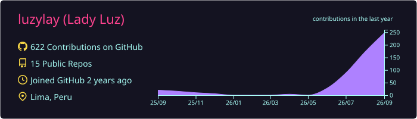

# 💻 Lady Loayza Rodriguez

  

I am a **Software Engineering Student** specializing in **Data Engineering & Business Intelligence**. I focus on designing efficient, scalable data pipelines (ETL/ELT), dimensional modeling, and turning raw datasets into structured, high-value business assets.

*   🌱 **Currently Exploring:** Cloud Data Warehousing (AWS/GCP), Apache Airflow, and dbt (data build tool).
*   ⚡ **Core Philosophy:** Automation-first, clean code, and robust error handling in data integration processes.

---

*GitHub's native language stats are great, but here is the specific toolkit I leverage daily to build data solutions:*

| Category | Technologies & Tools Stack|
| :--- | :--- |
| **Languages** |    |
| **Data Engineering** |    |
| **Databases** |   |
| **BI & Analytics** |   |
| **DevOps & Version Control** |   |

---

## 🧠 Data Engineering Principles I Apply
*Beyond coding, these are the methodologies and best practices I implement in my repositories:*

*   **Dimensional Modeling:** Designing clean Star and Snowflake schemas (Facts and Dimensions) optimized for BI analytical queries.
*   **Pipeline Reliability:** Incorporating try-catch exception handling, logging, and performance tuning (e.g., batch inserts using `SQLAlchemy` and database indexing).
*   **Data Integrity:** Validating data types, handling missing values, and ensuring schema constraints are enforced during the transform (T) phase.

---

### 📊 GitHub Activity & Detailed Stats
*My contribution records, commits, pull requests, reviews, and active streaks:*

  

  
  &nbsp;&nbsp;
  

  

### 🌈 3D Contribution Graph

  

   
  

